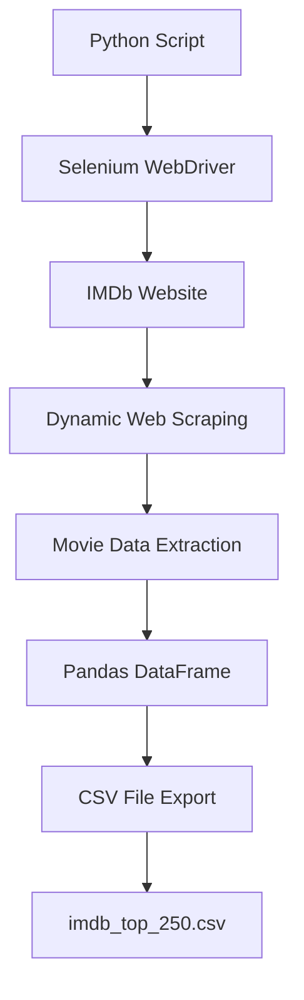

# 🎬 IMDb Movie Rating Scraper

### Automated IMDb Top 250 Movie Data Scraper


---

## 🌟 About The Project

IMDb Movie Rating Scraper is an automated web scraping application developed using Python and Selenium WebDriver. The system collects movie information directly from the IMDb Top 250 Movies list and stores the extracted data into a structured CSV file for analysis and visualization.

The scraper automatically extracts:
- Movie Rank
- Movie Title
- Release Year
- IMDb Rating

This project demonstrates practical implementation of:
- Selenium Web Scraping
- Browser Automation
- Dynamic Data Extraction
- CSV Data Processing
- Movie Dataset Collection
- Python Automation

---

## ✨ Key Features

- 🎬 IMDb Top 250 Movie Scraping
- 🤖 Automated Browser Automation
- 📊 Structured CSV Data Export
- ⚡ Dynamic JavaScript Content Handling
- 🔍 Automated HTML Element Extraction
- 🛠️ Exception Handling & Error Management
- 📁 Data Storage using Pandas
- 🚀 Fast & Lightweight Python Implementation

---

## 🏗️ System Architecture



---

## ⚡ Technologies Used

| Category | Technologies |
|----------|--------------|
| Programming Language | Python |
| Web Scraping | Selenium WebDriver |
| Data Handling | Pandas |
| Browser Automation | ChromeDriver |
| Data Source | IMDb Top 250 |
| File Storage | CSV |

---

## 📂 Project Structure

```txt
imdb-movie-rating-scraper/
│
├── main.py
├── imdb_top_250.csv
├── requirements.txt
├── screenshots/
├── README.md
└── LICENSE
```

---

## 🚀 Installation & Setup

### 🔹 Clone Repository

```bash
git clone https://github.com/yourusername/imdb-movie-rating-scraper.git

cd imdb-movie-rating-scraper
```

---

## 🔹 Install Required Libraries

```bash
pip install selenium pandas webdriver-manager
```

---

## 🔹 Installation of Selenium

```bash
pip install selenium
```

---

## 🔹 Verify Selenium Installation

```bash
python -m selenium --version
```

---

## ▶️ Run the Application

```bash
python main.py
```

---

## 🌐 Target Website

```txt
https://www.imdb.com/chart/top/
```

---

## 📊 Extracted Movie Data

The system automatically extracts:
- Movie Rank
- Movie Title
- Release Year
- IMDb Rating

---

## 📈 Sample Output

| Rank | Title | Year | Rating |
|------|-------|------|---------|
| 1 | The Shawshank Redemption | 1994 | 9.3 |
| 2 | The Godfather | 1972 | 9.2 |
| 3 | The Dark Knight | 2008 | 9.1 |

---

## 📸 Application Output

### 🖥️ IMDb Movie Dataset Output

- Terminal Output
- CSV File Export
- Movie Ranking Dataset
- Automated Web Scraping

---

## ⚡ Python Libraries Used

- Selenium
- Pandas
- webdriver-manager
- re
- time

---

## 🛠️ Core Functionalities

- Dynamic Website Navigation
- Automated Movie Data Extraction
- Browser Automation
- CSV File Generation
- Exception Handling
- Real-Time Dataset Collection

---

## 🌍 Real World Applications

- Movie Recommendation Systems
- Entertainment Data Analysis
- IMDb Rating Analytics
- Dataset Collection for Machine Learning
- Movie Trend Analysis
- Film Industry Research

---

## 🔮 Future Enhancements

- Genre-Based Movie Analysis
- Interactive Dashboard Visualization
- Real-Time IMDb Monitoring
- Database Integration
- AI-Based Recommendation System
- Automated Scheduled Scraping

---

## 🧠 Learning Outcomes

- Selenium Web Scraping
- Browser Automation
- Python Data Handling
- Dynamic Content Extraction
- CSV Dataset Processing
- Exception Handling Techniques

---

## ⚠️ Troubleshooting

| Error | Solution |
|------|-----------|
| ChromeDriver Error | Update Chrome Browser |
| NoSuchElementException | Update CSS Selectors |
| Page Loading Issue | Increase Wait Time |
| ModuleNotFoundError | Install Required Libraries |

---

## 🤝 Contributing

Contributions are welcome.

1. Fork the repository
2. Create a feature branch
3. Commit your changes
4. Push the branch
5. Open a Pull Request

---

## 📜 License

This project is licensed under the MIT License.

---

## 👨‍💻 Developed By

### Kowsika S

Department of Artificial Intelligence & Data Science

---

# ⭐ IMDb Movie Rating Scraper
### Automated IMDb Top 250 Movie Data Extractor
